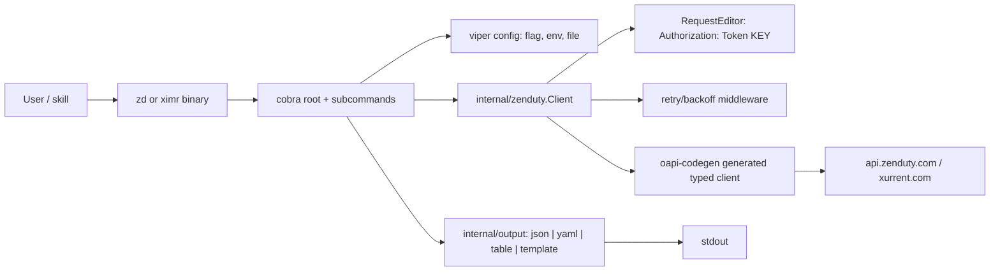
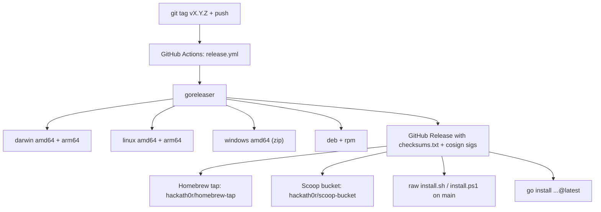

# zd-cli

> Cross-platform command-line interface for the [Zenduty / Xurrent IMR](https://www.zenduty.com) REST API. Fast incident workflows, scriptable on-call lookups, and idempotent alert ingestion from your terminal.

[](https://github.com/hackath0r/zd-cli/actions/workflows/ci.yml)
[](https://github.com/hackath0r/zd-cli/releases)
[](LICENSE)
[](https://goreportcard.com/report/github.com/hackath0r/zd-cli)
[](https://github.com/hackath0r/zd-cli/releases)

`zd` ships as a single static binary on every major platform — no Python,
Node, or Docker runtime needed. The same binary is also installed as
`ximr` so you can use either name. Output is a human-readable table on
a TTY and clean JSON when piped, so scripts and AI-driven skills get
structured data without flag gymnastics.

```sh
$ zd incident list --status open
NUMBER  STATUS        URGENCY  TITLE                       SERVICE          ASSIGNED_TO  CREATED
4815    triggered     high     payments-api timeout        payments-api     ada.lovelace 2026-05-06T08:42:13Z
4814    acknowledged  high     elevated 5xx in checkout    checkout-svc     grace.hopper 2026-05-06T08:21:55Z

$ zd incident ack 4815
$ zd incident note add 4815 -m "investigating; rolling back deploy abc123"
$ zd oncall now
TEAM     ESCALATION_POLICY   RULE_DELAY_MINUTES  USER          EMAIL
sre      sre-primary         0                   Ada Lovelace  ada@example.com
```

## Why `zd-cli`

- **Single binary, every OS.** Static Go build for macOS / Linux / Windows
  (amd64 + arm64). Cold-start in milliseconds.
- **Two names, one binary.** `zd` and `ximr` are interchangeable so you
  can adopt either depending on whether your team thinks of the product
  as Zenduty (legacy) or Xurrent IMR (current).
- **Generated from the OpenAPI spec.** Every typed request/response in
  `internal/zenduty/zenduty.gen.go` mirrors the upstream spec, so
  upstream additions become CLI commands with zero hand translation.
- **Honest about auth.** Zenduty's docs claim `Authorization: Bearer ...`
  but the API actually wants `Authorization: Token ...`. `zd-cli` always
  sends the right header (and tests guard against regression).
- **Built for scripting.** `--output json` (the default off-TTY) is
  always pure JSON; exit codes follow a documented contract:

  | Code | Meaning |
  | ---- | ---------------------------------------- |
  | 0    | success                                  |
  | 1    | API error (4xx / 5xx, retries exhausted) |
  | 2    | usage error (bad flags, missing args)    |
  | 3    | configuration error                      |
  | 4    | network or retry exhausted               |

- **Resilient by default.** Retries on 429 and 5xx with exponential
  backoff (capped at 4s), honours `Retry-After`, replays the request
  body safely.

## Install

### Homebrew (macOS / Linux)

```sh
brew install hackath0r/tap/zd-cli
```

### Scoop (Windows)

```powershell
scoop bucket add hackath0r https://github.com/hackath0r/scoop-bucket
scoop install zd-cli
```

### One-liner installer

```sh
# macOS / Linux
curl -fsSL https://raw.githubusercontent.com/hackath0r/zd-cli/main/scripts/install.sh | sh

# Windows (PowerShell)
iwr -useb https://raw.githubusercontent.com/hackath0r/zd-cli/main/scripts/install.ps1 | iex
```

The installer downloads the latest release, verifies the sha256, drops
both `zd` and `ximr` on `PATH`, and (on macOS) clears the Gatekeeper
quarantine xattr because we don't currently ship Apple-notarized
binaries.

### Debian / Ubuntu (apt)

```sh
curl -fsSL "https://github.com/hackath0r/zd-cli/releases/latest/download/zd_$(dpkg --print-architecture).deb" -o /tmp/zd.deb
sudo apt install /tmp/zd.deb
```

### RHEL / Fedora / CentOS (rpm)

```sh
sudo rpm -Uvh "https://github.com/hackath0r/zd-cli/releases/latest/download/zd_$(rpm --eval %{_arch}).rpm"
```

### Go (latest tagged release)

```sh
go install github.com/hackath0r/zd-cli/cmd/zd@latest
```

### Direct download

Pre-built archives, deb / rpm packages, and `checksums.txt` are on every
[GitHub Release](https://github.com/hackath0r/zd-cli/releases).

## Quickstart

```sh
zd config init                                 # writes ~/.config/zd/config.yaml
export ZENDUTY_API_TOKEN=zd_xxxxxxxxxxxxxx     # or set per-profile via token_env
zd config doctor                               # GET /api/account/members/ smoke test
zd incident list                               # open incidents, table on TTY, JSON when piped
zd oncall now                                  # uses default_team from the profile
```

Generate an API token at: **Zenduty / Xurrent console -> Account -> API Keys**.

## Cheat sheet

### Incident response

| Command | What it does |
| ------- | ------------- |
| `zd incident list --status open` | List open (triggered + acknowledged) incidents |
| `zd incident get 4815`           | Show one incident |
| `zd incident ack 4815` / `zd incident resolve 4815` | Ack / resolve |
| `zd incident note add 4815 -m "rollback abc123"` | Drop a timeline note |
| `zd incident responder add-user 4815 --user grace.hopper` | Page a teammate |
| `zd event fire --integration-key K --message "db unreachable" --entity-id db-1 --wait` | Fire an alert and wait for ingestion to terminate |
| `zd event status <trace-id> --watch` | Poll a trace until completed/failed |
| `zd oncall list --team T` / `zd oncall now` | Oncall roster / current primaries |

### Admin & configuration

| Command | What it does |
| ------- | ------------- |
| `zd team list` / `zd team get <id>` / `zd team create --name foo` | Manage teams |
| `zd team member add <team-id> --user alice --role 1` | Add a team member |
| `zd service create <team-id> --name api --escalation-policy <ep-id>` | Create a service |
| `zd schedule create <team-id> --body @schedule.json` | Create a complex on-call schedule |
| `zd schedule override add <team-id> <sched-id> --user alice --start-time ... --end-time ...` | One-off shift swap |
| `zd escalation-policy create <team-id> --body @ep.json` | Create an escalation policy |
| `zd priority create <team-id> --name P0 --color "#ff0000"` | Define a priority |
| `zd integration transformer create <t> <s> <int> --body @rule.json` | Create an alert rule (alias: `zd alert-rule create ...`) |
| `zd router list` / `zd router ruleset create <router-id> --body @rs.json` | Manage event routers + rulesets |
| `zd analytics incidents --from 2026-01-01 --to 2026-04-30` | Quarterly incident stats |
| `zd account custom-role list` / `zd account invite --email alice@co.com` | Account-level admin |

Pair with `--output json` and `jq` for scripting:

```sh
zd incident list --status open --output json | jq '.[] | select(.urgency == "high") | .incident_number'
```

## Configuration

`zd-cli` resolves every value with this precedence: **flag > env > profile
> default**. Profiles live in `~/.config/zd/config.yaml` (or
`$XDG_CONFIG_HOME/zd/config.yaml`). The file is `0600` by design.

```yaml
default_profile: prod
profiles:
  prod:
    host: https://www.zenduty.com
    token_env: ZENDUTY_API_TOKEN
    account_id: ABCDE
    default_team: 03f7b1c2-...
  staging:
    host: https://www.zenduty.com
    token_env: ZENDUTY_STAGING_TOKEN
```

| Field          | Meaning |
| -------------- | -------- |
| `host`         | API base URL. Defaults to `https://www.zenduty.com`. |
| `token`        | Token stored inline (discouraged; use `token_env` instead). |
| `token_env`    | Environment variable name to read the token from. |
| `account_id`   | 5-character account identifier; required by `zd event fire`. |
| `default_team` | Used by `zd oncall now` and as a fallback for team-scoped commands. |

Switch profiles with `zd config use <profile>` or per-invocation with
`--profile <name>`.

## Output formats

```
--output table     Human table (default on TTY)
--output json      Pretty JSON (default when piped)
--output yaml      YAML
--output template  Custom Go text/template via --template
```

Examples:

```sh
zd incident list --output template --template '{{range .}}{{.incident_number}} {{.title}}\n{{end}}'

zd oncall now --output yaml
```

## Skills & scripting

Because `--output json` is the default when stdout isn't a TTY, you can
pipe `zd-cli` directly into other tools without any flags:

```sh
# Top 5 oldest open high-urgency incidents
zd incident list --status open | jq '[.[] | select(.urgency=="high")] | sort_by(.creation_date) | .[:5]'

# Idempotent alert from CI (entity-id dedupes on retry)
zd event fire --integration-key "$ZD_INTEGRATION" \
  --message "build $CI_BUILD_ID failed" \
  --entity-id "build-$CI_BUILD_ID" \
  --wait
```

For Cursor and other AI-driven workflows, every command's stderr on
failure is structured JSON, so you can branch on `error.code`,
`error.status`, or `error.url` without parsing prose.

## Architecture





## Coverage

`zd-cli v0.2.x` wraps the **entire** Zenduty / Xurrent IMR public API
surface — every operation in the upstream OpenAPI spec is reachable from
the CLI today:

| Area | Status | Commands |
| ---- | ------ | -------- |
| Incidents               | full | `list` / `get` / `create` / `update` / `ack` / `resolve` / `alerts` / `note` / `tag` / `responder` |
| Events                  | full | `fire` / `ack` / `resolve` / `status` (with `--wait` / `--watch`) |
| Oncall                  | full | `list` / `who` / `now` |
| Config                  | full | `init` / `show` / `use` / `set` / `doctor` / `path` |
| Account                 | full | `member` / `custom-role` / `invite` / `delete-user` / `regenerate-integration-key` / `integration-metadata` |
| Users                   | full | `list` / `get` / `update` / `contact` / `forwarding-rule` / `notification-rule` / `custom-role` |
| Teams                   | full | `list` / `get` / `create` / `update` / `delete` / `member` / `permission` / `role` / `task-template` |
| Services                | full | `list` / `get` / `create` / `update` / `delete` |
| Schedules               | full | `list` / `get` / `create` / `update` / `delete` / `override list` / `override add` |
| Escalation policies     | full | `list` / `get` / `create` / `update` / `delete` |
| Priorities              | full | `list` / `get` / `create` / `update` / `delete` |
| Tags                    | full | `list` / `get` / `create` / `update` / `delete` (per-team) |
| SLAs                    | full | `list` / `get` / `create` / `update` / `delete` |
| Postmortems             | full | `list` / `get` / `create` / `update` / `delete` |
| Maintenance windows     | full | `list` / `get` / `create` / `update` / `delete` |
| Event router + rulesets | full | `list` / `get` / `create` / `update` / `delete` / `ruleset` (CRUD + reorder) |
| Integrations            | full | `list` / `get` / `create` / `update` / `delete` + `transformer` (alias `alert-rule`, full CRUD) |
| Analytics               | full | `incidents` / `services` / `teams` / `users` (filter via `--from / --to / --body`) |

Around **140 distinct API call sites** are wired up across 18 top-level
commands, mirroring the ~140 unique operations in the upstream OpenAPI
spec. Auto-generated reference for every subcommand and flag lives at
[`docs/commands/`](docs/commands).

For write operations, you can pass the request body either via
convenience flags (e.g. `--name`, `--from`, `--to`, `--user`) or as a
raw JSON object via `--body @file.json`, `--body -` (stdin), or
`--data '{...}'`. Convenience flags fill in known fields; `--body`
takes precedence whenever the same key is set in both. The OpenAPI
spec is vendored at `api/openapi.yaml` and a weekly `openapi-sync`
workflow keeps it fresh.

## Contributing

See [`CONTRIBUTING.md`](CONTRIBUTING.md). Conventional Commits are
enforced for the changelog. Please open an issue before working on a
large feature so we don't duplicate effort.

## Brand note

Zenduty was acquired by [Xurrent](https://www.xurrent.com) in 2025 and
rebranded to *Xurrent Incident Management & Response* (IMR). The same
binary is shipped as both `zd` and `ximr` so you can pick whichever name
fits your team's terminology. The default API host is still
`https://www.zenduty.com` until the upstream migration completes; see
[`docs/BRAND.md`](docs/BRAND.md) for details.

## Acknowledgments

- Built on top of the official [Zenduty OpenAPI spec](https://apidocs.zenduty.com).
- Generated client courtesy of [oapi-codegen](https://github.com/oapi-codegen/oapi-codegen).
- CLI ergonomics on [cobra](https://github.com/spf13/cobra) and
  [viper](https://github.com/spf13/viper).
- Cross-platform releases by [GoReleaser](https://goreleaser.com).
- Thanks to the broader Zenduty / Xurrent community whose support
  conversations informed the foot-gun fixes (`Token` vs `Bearer`,
  malformed path placeholders, list-vs-singleton spec quirks).

## License

Apache License 2.0. See [`LICENSE`](LICENSE) and [`NOTICE`](NOTICE).
